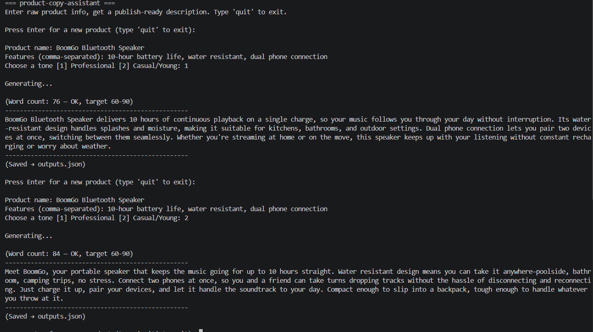

# product-copy-assistant

A Claude-powered terminal assistant that turns raw product info into publish-ready e-commerce copy.

## Description

Writing product descriptions is the silent time sink of e-commerce: a seller with a 200-item catalog faces days of repetitive copywriting, and rushed copy tends to drift into clichés or invented claims. This tool takes a product name and a comma-separated feature list, and returns a clean, on-brand paragraph in seconds — in the seller's own language and chosen brand voice. It is built for small e-commerce sellers, marketplace vendors, and agencies that manage product catalogs at scale.

## Features

- **Two-tone generation** — a tone selector switches between a corporate *Professional* voice and a young, energetic *Casual* voice, each anchored by its own in-role example.
- **Hallucination guard** — the prompt distinguishes *allowed inference* (what follows from the product's definition) from *invented claims* (plausible-sounding features never stated by the user). If it could be false for some units, it doesn't get written.
- **Dynamic word band** — 60–90 words for normal input, automatically relaxed to 30–60 for sparse input (a single feature), so length pressure never incentivizes the model to pad with invented details.
- **Feedback-based retry** ⭐ — outputs are validated in code; out-of-band results are sent back to the model *with* the failed text and a directed fix ("expand"/"shorten", same features only). A self-correcting loop instead of blind re-rolls.
- **Language detection** — Turkish input yields Turkish copy, English input yields English copy; product names are never translated.
- **Generation archive** — every result is appended to `outputs.json` with product, tone, and timestamp.

## Example Output



Same product, two voices.

## Prompt Design ⭐

The system prompt is a **6-layer hybrid**: only the first layer changes with the tone selector; the rest stay fixed.

1. **Role** (swappable) — copywriter persona, Professional or Casual
2. **Task** — raw info in, publish-ready paragraph out
3. **Language rule** — output language always follows input language
4. **Hallucination rule** — allowed-inference vs. invented-claim boundary
5. **Format contract** — strict word band, no lead-ins, no trailing notes
6. **Forbidden list + few-shot examples** — banned clichés, format/language/sparse-input examples

Two design ideas carry the architecture. First, **per-role tone examples**: each role embeds a full example written in its own voice, because a shared example pool pulled both tones toward the same middle register. Second, an **authority clause**: shared examples are explicitly scoped to format and language only, while each role's tone example is declared authoritative for voice — and tone examples are marked "imitate register, not language" so a Turkish example never overrides the language rule on English input. Both fixes follow the same empirical lesson: *examples beat rules*. When a rule and an example disagreed, the model followed the example — boundary cases favored few-shot 2-0 in testing.

## Design Decisions ⭐

- **No conversation history between products.** Each product is an independent generation (analyzer pattern, not a chat). Descriptions never leak features from previous products, and the context stays minimal. The only exception is intentional: the feedback-retry loop keeps history *within* a single product's correction turns.
- **Claude Haiku as the model.** Product copy is a short, well-constrained generation task — exactly the cost/latency profile Haiku is built for. The strictness lives in the prompt and the code-side validation, not in model size.
- **Word band tuned for Turkish.** Turkish is agglutinative: the same content lands in fewer, longer words than English. The 60–90 band (and the retry loop's "expand" feedback) accounts for Turkish outputs naturally sitting lower in the range.
- **Known limitation: example parroting.** The assistant must not be evaluated with products that appear in its own few-shot examples (thermos, ceramic mug) — the model reproduces example phrasing instead of generating fresh copy. All acceptance tests use out-of-example products.

## Setup

```bash
git clone https://github.com/<your-username>/product-copy-assistant.git
cd product-copy-assistant
python -m venv venv
venv\Scripts\activate        # Windows  (macOS/Linux: source venv/bin/activate)
pip install -r requirements.txt
```

Copy `.env.example` to `.env` and add your `ANTHROPIC_API_KEY`:

```
ANTHROPIC_API_KEY=sk-ant-...
```

## Usage

```bash
python assistant.py
```

```
Product name: BoomGo speaker
Features (comma-separated): 10 hour battery, waterproof, compact design
Choose a tone [1] Professional [2] Casual/Young: 2
```

The generated description is printed to the terminal and archived in `outputs.json`.

## Tech Stack

Python · Anthropic API (Claude Haiku) · python-dotenv · JSON
